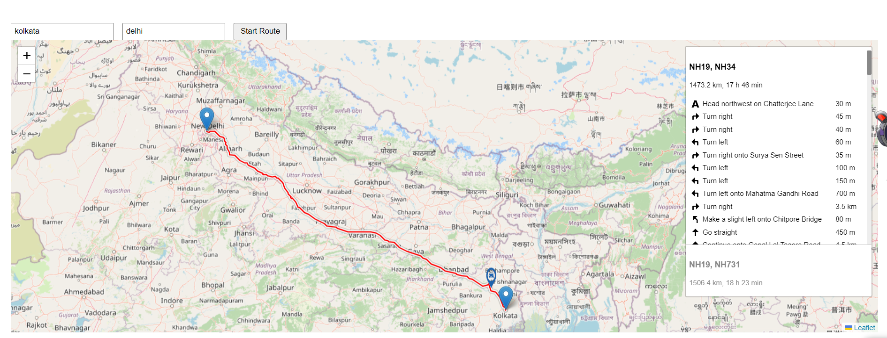

# Vehicle Tracking System

## Screenshots

### Application Screenshot




## Overview

The Vehicle Tracking System is a web application developed using Node.js and EJS. It integrates with the Google Maps API to provide dynamic route tracking between two user-input locations. The application simulates a vehicle moving along the calculated route, offering a real-time visualization of the journey.

## Features

- **Google Maps Integration:** Displays maps and routes using the Google Maps API.
- **Dynamic Route Calculation:** Calculates and visualizes routes between two user-input locations.
- **Car Movement Simulation:** Simulates a car's movement along the route with a configurable delay.
- **Real-time Updates:** Uses Socket.IO for real-time updates on vehicle position.

## Technologies Used

- **Node.js:** Backend server
- **EJS:** Templating engine for rendering dynamic content
- **Google Maps API:** For map visualization and route calculation
- **Leaflet.js:** For interactive map functionalities
- **Socket.IO:** For real-time communication between client and server

## Setup Instructions

### Prerequisites

Ensure you have the following installed:
- Node.js and npm

### Installation

1. **Clone the Repository**

    ```bash
    git clone https://github.com/sujoyghoshal/Google-Maps-Tracker.git
    cd Google-Maps-Tracker.git
    ```

2. **Install Dependencies**

    ```bash
    npm install
    ```

3. **Run the Application**

    ```bash
    nodemon index.js or node index.js
    ```

    Navigate to `http://localhost:3000` in your web browser to view the application.

## Hosted Link

You can view the hosted version of the project at [404].

## GitHub Repository

The source code for this project is available at [https://github.com/sujoyghoshal/Google-Maps-Tracker].

## Contact

For any queries or feedback, please reach out to [sujoyghoshal.s@gmail.com].
